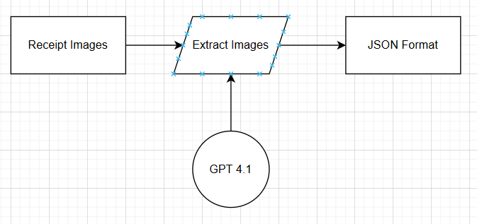
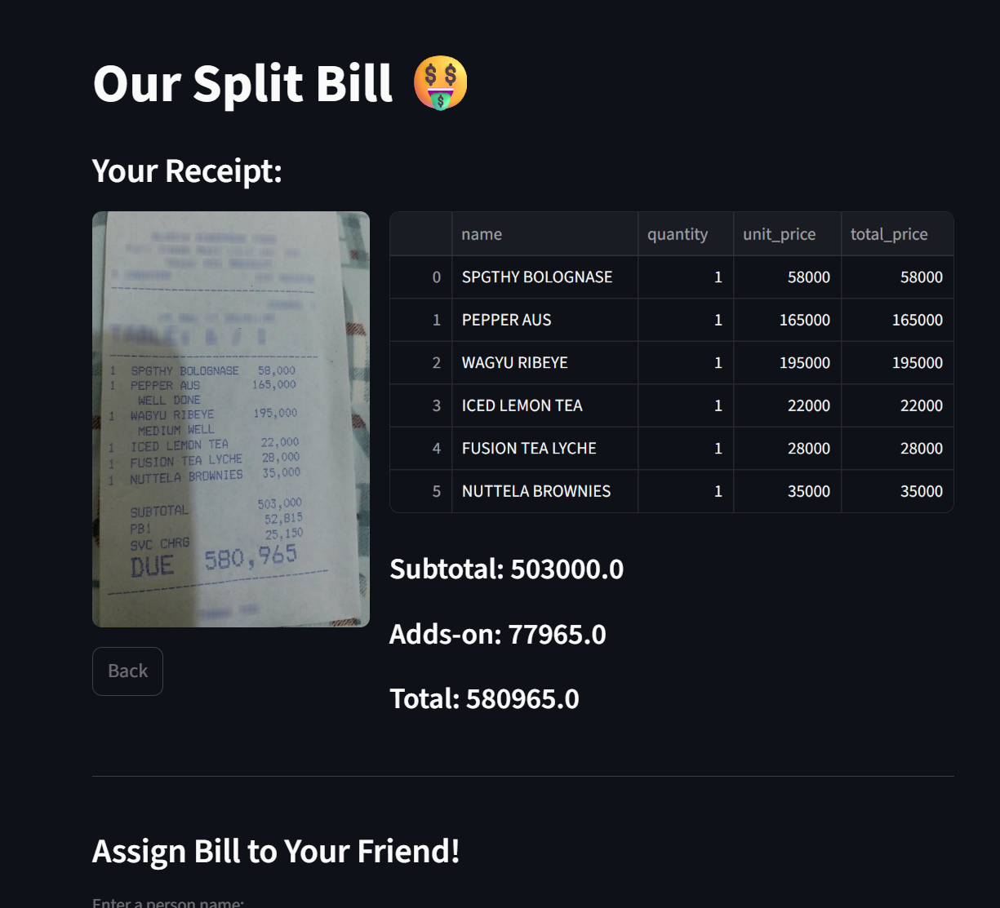

# SplitBill-AI

SplitBill-AI is a Streamlit-based application that automatically splits bills using GPT assistance. This app helps users calculate the cost per person, including taxes and additional fees, and displays a detailed list of purchased items with their prices.

## Features
- Extracts items and prices from user input.
- Calculates total cost per item and per person.
- Adds taxes and additional fees proportionally.
- Displays results in a clear and readable format.
- Integrates GPT to parse input into structured JSON.
  
## Workflow


## Application Interface


## Project Structure
```
splitbill-ai/
├─ .streamlit/ # Streamlit configuration
├─ data/ # Receipt Image
├─ research/ # Documentation or experiments on 2 technique (donuts/vlm)
├─ src/
    ├─ # Modules and helper functions
├─ website.py # Main Streamlit file
├─ requirements.txt # Project dependencies
└─ .gitignore
```

## Analysis of the Final Product

### 1. Weaknesses Related to the AI Model
- **High Cost:** Using the AI model, especially with frequent API calls or large inputs, can be expensive.  

### 2. Ideas for AI Model Improvement
- **Greater LLM Models:** Utilize larger or more advanced language models to improve parsing accuracy and context understanding.  

### 3. Weaknesses of the Product
- **Logical Validation Issues:** The product may not always validate the logic of input data, leading to potential inconsistencies in bill splitting or total calculations.  

### 4. Ideas for Product Improvement
- **Auto-Suggestion for Bill Allocation:** Provide recommended allocations per person based on detected items.  
- **Clear UI:** Enhance the user interface for better readability and user experience.  


## Pre-Requistie
1. Get your own OpenAI Api Key: [OpenAi](https://platform.openai.com/api-keys)
2. Rename secrets.toml.example -> secrets.toml
3. Edit secrets.toml file
```
[api]
openai = "YOUR_API_KEY" // edit YOUR_API_KEY to your own openai api_key
```

## Installation
1. Clone this repository (Open your CMD):
```
git clone https://github.com/RasyidDevs/splitbill-ai.git
cd splitbill-ai
code .
```
2. Create Enviroments
```
python -m venv venv
source venv/bin/activate   # Linux/Mac
venv\Scripts\activate      # Windows
```
4. Install Depedencies
```
pip install -r requirements.txt
```
5. Run Streamlit
```
streamlit run website.py
```


